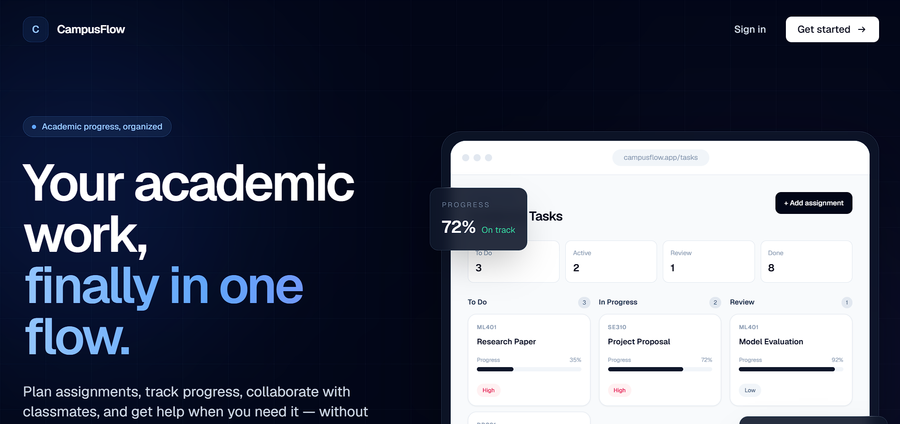
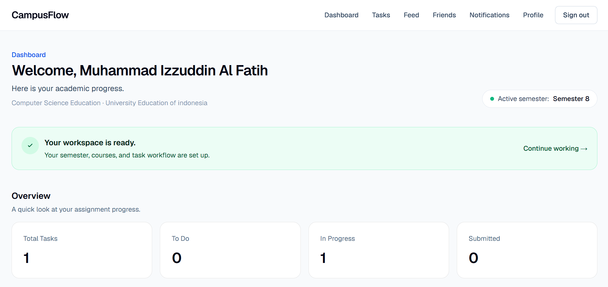
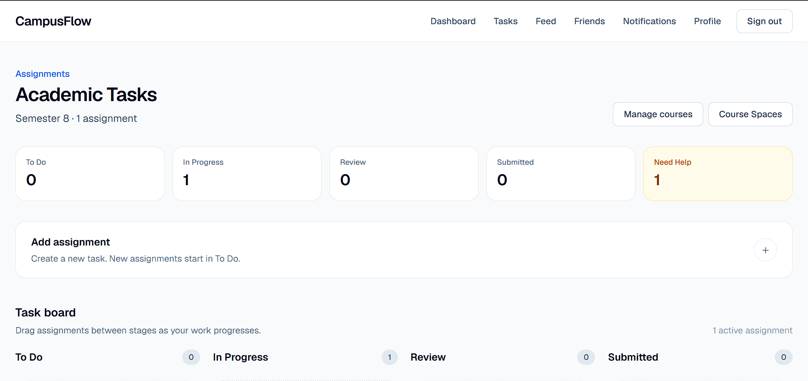

# CampusFlow

CampusFlow is a social academic progress tracker designed for students to organize coursework, track assignment progress, collaborate with classmates, and ask for help without turning academic work into a general-purpose social network.

The platform combines personal task management with controlled academic sharing through Friends and Course Spaces.

**Live Demo:** https://campusflow-beryl-beta.vercel.app

**Repository:** https://github.com/mialfatih/campusflow

---

## Overview

Students often manage academic work across separate tools such as task managers, notes, messaging apps, class groups, and spreadsheets.

CampusFlow brings those workflows into one academic workspace.

Users can:

- organize semesters and courses
- manage assignments through a Kanban workflow
- track manual or checklist-based progress
- share selected academic progress
- connect with classmates
- create or join Course Spaces
- request contextual help on assignments
- collaborate inside focused Help Rooms
- review automatic academic activity
- manage notifications
- control who can see each assignment

CampusFlow is designed around a simple principle:

> Academic progress should be easy to organize, useful to share, and private by default.

---

## Live Demo

CampusFlow is deployed on Vercel:

https://campusflow-beryl-beta.vercel.app

The production application uses Supabase for authentication, PostgreSQL storage, Row Level Security, database functions, triggers, and backend workflows.

---

## Core Features

### Academic Dashboard

The dashboard provides a summary of the student's current academic workload.

It includes:

- total assignments
- tasks to do
- work in progress
- submitted assignments
- active semester information
- workspace shortcuts
- lightweight onboarding
- sharing guidance

New users receive a data-driven setup guide based on their actual workspace state.

The onboarding flow follows this sequence:

```text
Create semester
      ↓
Add courses
      ↓
Add first assignment
      ↓
Start tracking progress
```

CampusFlow does not store a separate onboarding completion flag.

Instead, onboarding progress is calculated from actual user data.

---

## Semester Management

Students can create semesters and choose which semester is currently active.

An active semester determines which courses and assignments appear in the main academic workflow.

Typical structure:

```text
Student
  │
  ├── Semester 1
  │     ├── Course A
  │     └── Course B
  │
  └── Semester 2
        ├── Course C
        └── Course D
```

---

## Course Management

Students can create personal courses inside a semester.

Each course contains:

- course name
- course code
- semester relationship
- optional Course Space connection

Course names can be updated.

Course codes are treated as stable academic identifiers after creation.

A personal course belongs to one student even when it is connected to a Course Space.

---

## Assignment Management

Assignments contain:

- course
- title
- description
- deadline
- priority
- status
- progress
- visibility
- Need Help state
- manual ordering position

CampusFlow uses four assignment stages:

```text
To Do
  ↓
In Progress
  ↓
Review
  ↓
Submitted
```

Assignments can be moved between stages through drag and drop.

Tasks can also be reordered manually inside a Kanban column.

New assignments are placed at the bottom of the To Do column.

When an assignment is moved into another stage, it is placed at the bottom of the destination column.

---

## Kanban Workflow

CampusFlow provides a Kanban-style assignment board with four columns:

- To Do
- In Progress
- Review
- Submitted

The task board supports:

- drag and drop
- empty-column dropping
- manual ordering
- priority indicators
- progress bars
- assignment visibility badges
- Need Help indicators
- assignment editing
- assignment deletion

---

## Checklist-Based Progress

Assignments can contain checklist items.

When a checklist exists, the checklist becomes the source of truth for assignment progress.

Example:

```text
3 of 4 checklist items completed
→ 75% progress
```

Assignments without checklist items can use manual progress.

Checklist behavior includes:

- completed checklist items update progress automatically
- incomplete checklist items prevent submission
- fully completed checklists produce 100% progress
- submitted assignments can be moved backward
- moving a submitted assignment backward recalculates progress from the checklist

This prevents manual progress values from conflicting with checklist completion.

---

## Assignment Priority

Assignments support three priority levels:

```text
Low
Medium
High
```

Priority is represented visually on task cards.

High-priority assignments use stronger visual emphasis, while lower-priority assignments remain more neutral.

---

## Assignment Visibility

Each assignment has its own visibility setting.

| Visibility | Who can see it                                        |
| ---------- | ----------------------------------------------------- |
| Private    | Assignment owner only                                 |
| Friends    | Owner and accepted friends                            |
| Course     | Owner and members of the exact connected Course Space |

CampusFlow does not treat all users with the same course code as classmates.

Course-visible sharing requires membership in the same Course Space.

Example:

```text
Student A
Course Code: ML401
Course Space: Machine Learning A

Student B
Course Code: ML401
Course Space: Machine Learning B

Result:
Student A and Student B do not automatically see each other's Course-visible assignments.
```

This keeps course-based sharing scoped to the correct academic group.

---

## Course Spaces

Course Spaces provide the collaborative layer of CampusFlow.

A personal course remains owned by an individual student, while a Course Space represents a specific shared class or academic circle.

A Course Space contains:

- shared name
- course code
- invite code
- owner
- members
- shared academic progress

Example:

```text
Personal Course
Machine Learning
ML401
       │
       │ optional connection
       ▼
Course Space
Machine Learning — Class A
Invite Code: 8F3A12CD
       │
       ├── Student A
       ├── Student B
       ├── Student C
       └── Student D
```

---

## Course Space Invite Codes

Each Course Space has a unique invite code.

Students can join a Course Space using the invite code while connecting one of their personal courses.

If both the personal course and Course Space have course codes, those codes must match.

This prevents accidental connection to an unrelated academic class.

---

## Course Space Roles

Course Spaces currently support two roles:

```text
Owner
Member
```

The owner creates and manages the Course Space.

The owner does not control other students' personal courses or assignments.

Members participate in the shared academic circle.

---

## Shared Course Progress

Members of a Course Space can view academic work shared with `Course` visibility.

Shared progress is filtered by the database.

Only assignments that satisfy the Course Space visibility rules are returned.

Personal or Friends-only assignments are not exposed through Course Space progress.

---

## Course Space Lifecycle

CampusFlow separates collaborative membership from personal academic ownership.

When a member leaves a Course Space:

- the personal course remains
- assignments remain
- checklists remain
- progress remains
- Course-visible sharing stops
- relevant pending Course-based help offers are cancelled

When the owner dissolves a Course Space:

- personal courses remain
- assignments remain
- checklists remain
- progress remains
- memberships are removed
- the shared Course Space layer is deleted

The Course Space does not own students' personal assignments.

---

## Friends

Students can search CampusFlow users by username and create friend relationships.

Supported friend workflows include:

- send friend request
- accept friend request
- decline friend request
- cancel outgoing request
- remove friend

Friendship and Course Space membership are independent.

Removing a friend does not remove a shared Course Space membership.

Leaving a Course Space does not remove a friendship.

---

## Find Classmates

CampusFlow provides a user search page.

Students can search profiles by username.

Search results indicate the current relationship state:

```text
Add friend
Request sent
Friends
Respond to request
```

---

## Academic Feed

CampusFlow does not use manual social posts.

Instead, the feed is generated automatically from meaningful academic activity.

Examples include:

- assignment created
- assignment status changed
- assignment submitted
- Need Help requested
- Need Help resolved

Feed visibility follows the underlying assignment visibility.

Example:

```text
Private
→ owner only

Friends
→ owner + accepted friends

Course
→ owner + members of the exact Course Space
```

---

## Activity Timeline

CampusFlow records academic activity automatically.

Activity events include:

```text
Task created
Status changed
Task submitted
Need Help requested
Need Help resolved
```

This gives students an academic history without requiring them to manually create updates.

---

## Need Help

Students can mark an assignment with **Need Help**.

Eligible users can then offer assistance.

Eligibility depends on assignment visibility.

For Friends-visible assignments:

```text
Accepted friend
→ may offer help
```

For Course-visible assignments:

```text
Member of the same Course Space
→ may offer help
```

For Private assignments:

```text
Other users
→ cannot offer help
```

Only one helper can be accepted for an active help session.

---

## Help Offers

Help offers support several states:

```text
Pending
Accepted
Declined
Cancelled
Completed
```

The assignment owner decides which helper to accept.

Pending help offers are managed separately from active help sessions.

---

## Help Rooms

After a help offer is accepted, CampusFlow creates a private Help Room.

The Help Room is available only to:

- the assignment owner
- the accepted helper

Typical workflow:

```text
Student marks assignment as Need Help
        ↓
Eligible classmate offers help
        ↓
Assignment owner accepts the offer
        ↓
Private Help Room becomes available
        ↓
Both users discuss the assignment
        ↓
Help session is resolved
        ↓
Help Room becomes read-only
```

Help Rooms are assignment-specific rather than general-purpose chats.

Completed Help Rooms remain readable after the session is resolved.

Accepted and completed Help Rooms also survive Course Space leave or dissolution events.

---

## Notifications

CampusFlow provides notifications for important social and help-related events.

Examples include:

- help offers
- accepted help sessions
- Help Room updates
- other supported academic interactions

Opening relevant Help Room notifications marks related notifications as read.

The notification system is intended to direct users toward meaningful academic actions rather than create a general-purpose social notification feed.

---

## Profiles

Each user has a CampusFlow profile containing:

- unique username
- full name
- university
- major
- bio

Users can edit their profile information.

---

## Username Management

Usernames are unique.

A username can contain:

```text
lowercase letters
numbers
dots
underscores
hyphens
```

Username length must be between 3 and 30 characters.

Users can change their username as long as the new username is available.

Changing a username does not change:

- account identity
- friendships
- assignments
- courses
- Course Space memberships
- permissions

If a user changes from:

```text
sahrul
```

to:

```text
sahril
```

then:

```text
sahrul
```

becomes available again unless another user claims it.

The internal user identity remains based on the account ID, not the username.

---

## Profile Visibility

Profile academic progress follows the same visibility model as the rest of CampusFlow.

The profile owner can see their own progress.

Accepted friends can see Friends-visible progress.

Members of the same Course Space can see eligible Course-visible progress.

Users who have no relevant relationship cannot access private academic progress.

---

## Authentication

CampusFlow uses Supabase Auth with server-side cookie-based authentication.

Supported workflows include:

- account registration
- email confirmation
- sign in
- sign out
- forgot password
- password reset

Unauthenticated users are redirected to the login page when accessing protected application routes.

---

## User Onboarding

New users receive onboarding directly on the Dashboard.

The onboarding state is calculated from actual user data.

CampusFlow checks whether the user has:

```text
1. Created an active semester
2. Added at least one course
3. Added at least one assignment
4. Started progressing an assignment
```

Example:

```text
✓ Create your semester
✓ Add your courses
→ Add your first assignment
  Start tracking progress
```

After all steps are complete:

```text
Your workspace is ready.
```

No additional onboarding table is required.

---

## Landing Page

CampusFlow includes a responsive public landing page.

The landing page explains:

- what CampusFlow is
- assignment management
- Course Spaces
- academic progress
- Need Help
- Help Rooms
- privacy controls
- collaboration workflow

The page includes CSS-based animation and motion.

Animations respect the user's:

```text
prefers-reduced-motion
```

accessibility setting.

---

## Responsive Navigation

CampusFlow uses a shared responsive application header.

Desktop navigation provides direct access to:

- Dashboard
- Tasks
- Feed
- Friends
- Notifications
- Profile
- Sign out

Mobile and tablet layouts use a compact menu.

---

## Interaction States

Important server actions provide visual pending states.

Examples:

```text
Add assignment
→ Adding...

Save assignment
→ Saving...

Create semester
→ Creating...

Set active semester
→ Activating...

Add course
→ Adding...

Create Course Space
→ Creating...

Join Course Space
→ Joining...

Add friend
→ Sending...

Accept request
→ Accepting...

Decline request
→ Declining...

Cancel request
→ Cancelling...

Save profile
→ Saving...
```

This prevents accidental duplicate submissions and gives users feedback while an operation is running.

---

## Confirmation Dialogs

Destructive actions use custom confirmation modals.

Examples include:

- Delete Assignment
- Delete Course
- Remove Friend
- Leave Course Space
- Delete Course Space

The confirmation UI explains what will happen before the action is executed.

---

## Technology Stack

### Frontend

- Next.js 16
- React
- TypeScript
- Tailwind CSS
- App Router
- React Server Components
- Server Actions
- `@dnd-kit/react`

### Backend

- Supabase
- PostgreSQL
- Supabase Auth
- Row Level Security
- PostgreSQL functions
- RPC functions
- database triggers

### Deployment

- Vercel
- Supabase Cloud

---

## Application Architecture

CampusFlow separates personal academic data from collaborative access.

```text
User
 │
 ├── Profile
 │
 ├── Semesters
 │    └── Courses
 │         └── Assignments
 │              └── Checklist Items
 │
 ├── Friend Requests
 │
 ├── Friendships
 │
 ├── Course Space Memberships
 │
 ├── Help Offers
 │    └── Help Messages
 │
 ├── Activities
 │
 └── Notifications
```

A personal course may optionally connect to a Course Space:

```text
Personal Course
     │
     │ optional
     ▼
Course Space
     │
     ├── Members
     ├── Course-visible assignments
     └── Shared progress
```

Personal academic ownership and shared academic access are kept separate.

---

## Privacy Architecture

Privacy is enforced at the database layer rather than relying only on frontend filtering.

CampusFlow uses:

- Supabase Row Level Security
- authenticated user ownership checks
- security-definer PostgreSQL functions
- controlled RPC access
- relationship-aware visibility rules

The application distinguishes between:

```text
Ownership
Friendship
Course Space membership
Help session participation
```

These relationships are evaluated independently.

Being a friend does not automatically provide Course Space access.

Being in the same Course Space does not automatically create a friendship.

---

## Database Model

Major tables include:

```text
profiles
semesters
courses
tasks
task_checklist_items
activities
friend_requests
friendships
course_spaces
course_space_members
help_offers
help_messages
notifications
```

The application also uses PostgreSQL functions and triggers for:

- friend relationship workflows
- social feed generation
- profile visibility
- Course Space membership checks
- shared Course Space progress
- contextual help workflows
- automatic activity generation
- task ordering
- notification handling

---

## Task Ordering

Assignments contain a numeric position value.

This allows CampusFlow to maintain manual ordering inside Kanban columns.

When a task is moved to a new stage:

```text
Task
→ destination status
→ bottom of destination column
```

Users can also move a task upward manually.

---

## Getting Started

### Prerequisites

You will need:

- Node.js 20 or newer
- npm
- a Supabase project

Clone the repository:

```bash
git clone https://github.com/mialfatih/campusflow.git
cd campusflow
```

Install dependencies:

```bash
npm install
```

Create:

```text
.env.local
```

Add:

```env
NEXT_PUBLIC_SUPABASE_URL=your_supabase_project_url
NEXT_PUBLIC_SUPABASE_PUBLISHABLE_KEY=your_supabase_publishable_key
```

Run the development server:

```bash
npm run dev
```

Open:

```text
http://localhost:3000
```

---

## Environment Variables

CampusFlow currently requires:

```env
NEXT_PUBLIC_SUPABASE_URL
NEXT_PUBLIC_SUPABASE_PUBLISHABLE_KEY
```

These variables should be configured in `.env.local` during local development.

For production deployment, the same variables should be configured in Vercel.

Do not commit `.env.local` to GitHub.

---

## Supabase Configuration

The application requires a Supabase backend containing:

- database tables
- indexes
- foreign keys
- Row Level Security policies
- PostgreSQL functions
- triggers

Authentication URL configuration should include local development:

```text
http://localhost:3000/**
```

and the production application:

```text
https://campusflow-beryl-beta.vercel.app/**
```

The production Site URL is:

```text
https://campusflow-beryl-beta.vercel.app
```

---

## Production Build

Create an optimized production build with:

```bash
npm run build
```

CampusFlow has been verified with a successful Next.js 16 production build.

The project uses a combination of:

- static routes
- dynamic routes
- partially prerendered routes

---

## Deployment

CampusFlow is deployed using Vercel.

Deployment flow:

```text
GitHub main branch
        ↓
Vercel
        ↓
Next.js production build
        ↓
Supabase environment variables
        ↓
Production application
```

Deployment steps:

1. Import the GitHub repository into Vercel.
2. Select the Next.js framework preset.
3. Add the Supabase environment variables.
4. Deploy the `main` branch.
5. Add the production URL to Supabase Auth URL Configuration.
6. Keep localhost as an allowed redirect for local development.

---

## Production URL

CampusFlow is available at:

https://campusflow-beryl-beta.vercel.app

---

## Current Project Status

CampusFlow currently includes the complete core V1 workflow:

- authentication
- email confirmation
- sign in and sign out
- password reset flow
- public landing page
- onboarding
- semester management
- course management
- assignment management
- Kanban workflow
- drag and drop
- manual task ordering
- checklist progress
- manual progress
- priority system
- visibility controls
- Friends
- People search
- Course Spaces
- shared Course progress
- automatic academic activity
- academic feed
- Need Help
- Help Offers
- Help Rooms
- notifications
- user profiles
- username editing
- responsive navigation
- confirmation dialogs
- pending interaction states
- Vercel production deployment

---

## Design Principles

CampusFlow intentionally avoids several common social-product patterns.

The application does not include:

- general-purpose public posts
- global chat rooms
- popularity metrics
- gamification systems
- AI-generated academic work

The focus is academic organization and contextual peer collaboration.

---

## Project Goals

CampusFlow explores how academic productivity and social collaboration can coexist without making student progress unnecessarily public.

The project focuses on:

```text
Personal productivity
        +
Controlled sharing
        +
Course-based collaboration
        +
Contextual peer support
```

CampusFlow is not intended to replace a Learning Management System.

Instead, it acts as a personal academic workspace with an optional collaborative layer.

---

## Future Development

Potential future improvements include:

- custom SMTP for higher-volume authentication email delivery
- richer notification preferences
- additional Course Space moderation controls
- automated testing
- database migration scripts
- improved accessibility testing
- deeper mobile interaction polish
- personal academic analytics
- custom production domain
- additional deployment automation

These features are outside the current V1 scope.

---

## Screenshots

### Landing Page

CampusFlow provides a responsive public landing page that introduces the product, academic workflow, collaboration features, and privacy-first approach.

[](https://campusflow-beryl-beta.vercel.app)

---

### Dashboard

The dashboard gives students an overview of their academic workload, active semester, assignment statistics, workspace status, and onboarding progress.

[](https://campusflow-beryl-beta.vercel.app/dashboard)

---

### Assignment Board

Assignments are organized through a Kanban workflow with progress tracking, priorities, visibility controls, drag and drop, and Need Help support.

[](https://campusflow-beryl-beta.vercel.app/tasks)

---

## Try CampusFlow

**Live Application:**  
https://campusflow-beryl-beta.vercel.app

**GitHub Repository:**  
https://github.com/mialfatih/campusflow

---

## Author

Developed by **Muhammad Izzuddin Al Fatih**

GitHub: [@mialfatih](https://github.com/mialfatih)

---

## License

This project is currently maintained as a portfolio and academic software project.